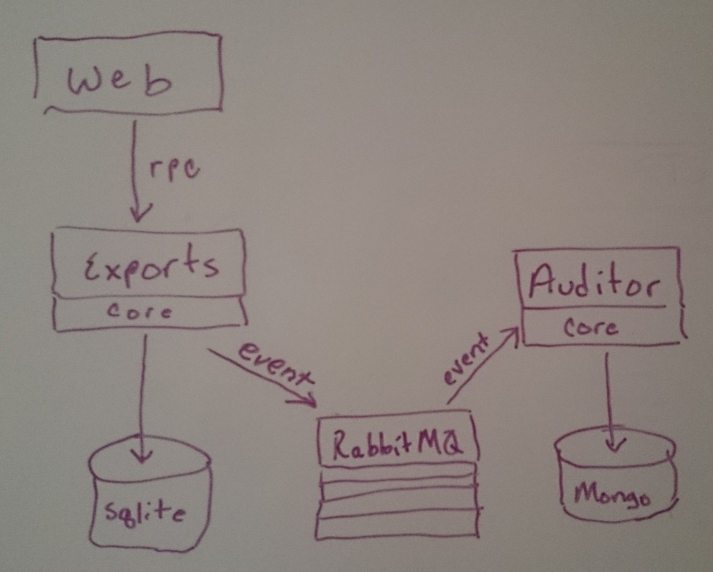

ruby_soa
========

Proof of concept playground for ruby-based service-oriented architecture.

## Setup

* ```git clone git@github.com:lwoodson/ruby_soa.git```
* ```cd ruby_soa```
* ```tar -xzf rabbitmq-server-mac-standalone-3.2.4.tar.gz```
* ```./rabbitmq_server-3.2.4/sbin/rabbitmq-plugins enable rabbitmq_management```
* ```tar -xzf mongodb-osx-x86_64-2.4.9.tgz```
* ```mkdir mongodb-osx-x86-65-2.4.9/db```
* ```foreman start```
* Point browser to app ```http://localhost:3000```
* Point browser to app ```http://localhost:3000/transitions```
* Point browser to rabbitmq management console (guest:guest): ```http://localhost:15672```

## Apps & libs

There are a few apps here, as follows:

### core
Core libraries that may be used across the apps.  In the real world, these would probably be gems.  Here, they are symlinked into projects.

### web
A rails web application that runs on port 3000.  Uses Her to map REST models from the exports_rpc service application.  Adds a service layer around Her/rest.  Page to interact with this service is at the app root.

### exports_rpc
A WS/RPC ruby service app to create exports and generate exported files.  Uses the Grape & Roar gems to provide a REST api.  Uses ActiveRecord and Sqlite3 for persistence.

### auditor
A message-driven ruby service app to log audits into a mongo database.  Receives messages from RabbitMQ that are published by the exports_rpc.

### RabbitMQ
A message-oriented middleware implementing the AMQP middleware.  Offers multi-model (queue/worker, pub/sub/ rpc), persistence, guaranteed delivery, management console, redundancy, failover, etc.. etc.. etc..

### MongoDB
Schema document database that we persist audits into.
